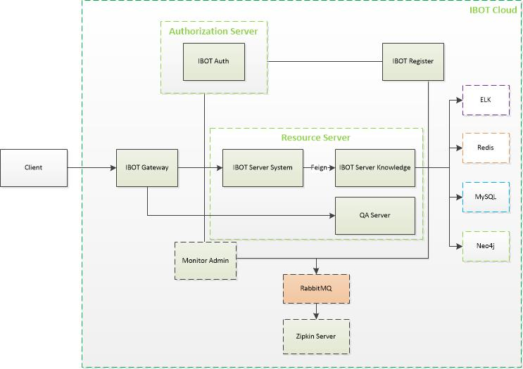
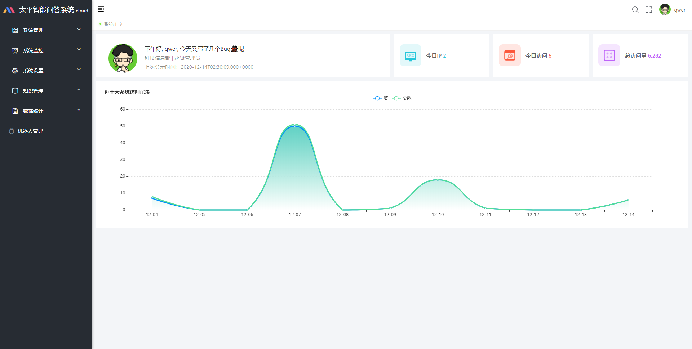

# 基于微服务架构的智能问答管理平台

IBot Cloud是一款使用Spring Cloud Hoxton.RELEASE、Spring Cloud OAuth2 & Spring Cloud Alibaba构建的低耦合智能问答管理平台系统，前端（IBot Cloud Web）采用vue element admin构建。IBot意指：**I**ntelligent **Bot**，目标是构建一个**界面简洁**，**功能易用**，**问答智能**的管理平台。该系统具有如下特点：

| 序号 | 特点                                                 |
| ---- | ---------------------------------------------------- |
| 1    | 前后端分离架构，客户端和服务端纯Token交互            |
| 2    | 认证服务器与资源服务器分离，方便接入自己的微服务系统 |
| 3    | 网关限流，网关黑名单限制                             |
| 4    | 微服务Docker化，使用Docker Compose一键部署，K8S集群  |
| 5    | 接入ELK日志管理系统，方便快捷地查看日志              |

**系统架构**

**功能模块**

**数据库ER图**

**服务模块**

| 服务名称              | 端口 | 描述               |
| --------------------- | ---- | ------------------ |
| ibot-auth             | 8101 | 微服务认证模块     |
| ibot-register         | 8001 | 微服务注册模块     |
| ibot-gateway          | 8301 | 微服务网关模块     |
| ibot-server-system    | 8201 | 微服务系统管理模块 |
| ibot-server-knowledge | 8202 | 微服务知识管理模块 |
| MySql                 | 3306 | MySql数据库        |
| Redis                 | 6379 | Redis缓存数据库    |
| ElasticSearch         | 9200 | 日志存储，知识存储 |
| Kibana                | 5601 | 日志展示           |
| Logstash              | 4560 | 日志收集           |

**演示地址**

主界面：

测试演示地址：[http://10.29.158.34:9527](http://10.29.158.34:9527)

测试账号密码：

| 账号 | 密码     | 权限                             |
| ---- | -------- | -------------------------------- |
| qwer | 1234qwer | 超级管理员，拥有所有增删改查权限 |

**联系人**

ganfeianqing@126.com

