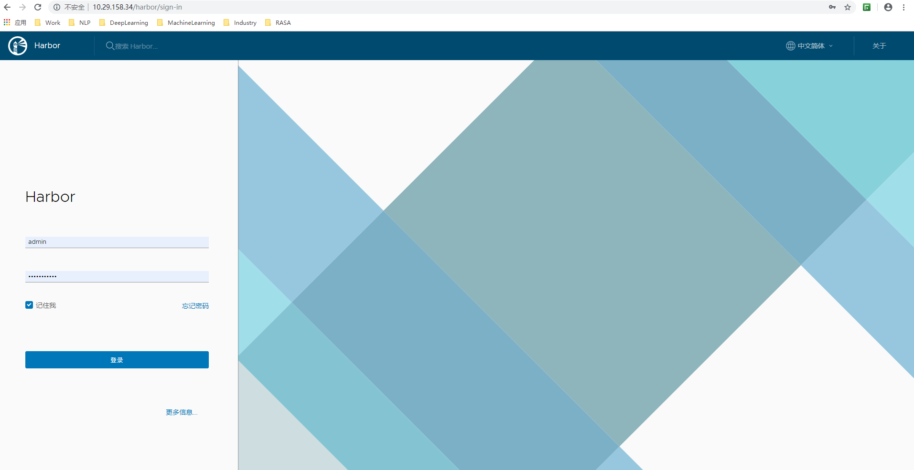
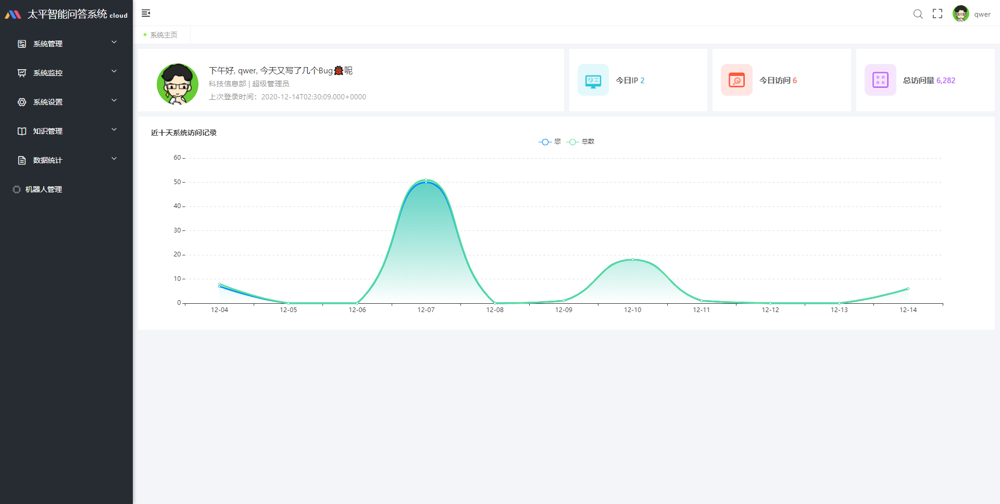

# K8S构建智能问答系统

我们只对ibot-auth、ibot-gateway、ibot-register、ibot-server-system、ibot-server-knowledge服务通过K8s进行集群部署（因为这些才是核心所在）。而像ELK等周边服务，我们部署一个实例即可，剩下的数据层，如Redis，MySQL数据库等，一般也不会通过k8s来搭建，通常是由公司DBA搭建提供，或者直接从阿里云、腾讯云等云平台购买高可用实例，所以这里，数据层面也是用Docker部署一个实例即可。

## 1. 集群环境准备

集群机器概况：

| 操作系统 | IP           | 角色        | CPU核心数 | 内存 | Hostname                      |
| -------- | ------------ | ----------- | --------- | ---- | ----------------------------- |
| CentOS 7 | 10.28.133.72 | Master      | 4         | 8G   | node15.test-tpl-hadoop-wh.com |
| CentOS 7 | 10.28.133.71 | Node1       | 4         | 8G   | node14.test-tpl-hadoop-wh.com |
| CentOS 7 | 10.28.133.73 | Node2       | 4         | 8G   | node16.test-tpl-hadoop-wh.com |
| CentOS 7 | 10.29.158.34 | Extend, NFS | 4         | 8G   | i-w3kg2zdk                    |

解释这些机器的作用：

1. Master（10.28.133.72）、Node1（10.28.133.71）、Node2（10.28.133.73）、用于搭建k8s集群环境，即后续的微服务集群部署；
2. NFS（10.29.158.34）虚拟机用于搭建NFS（Network File System，网络文件系统），作为k8s集群的第三方网络存储；
3. EXTEND（10.29.158.34）虚拟机用于安装第三方服务，如数据库，ELK等

## 2. NFS服务器搭建

在K8S中，我们虽然可以使用volume将容器内目录挂载到宿主机目录上，但由于Pod调度的不确定性，这种数据存储方式是不牢靠的。对于有状态的应用，我们希望无论Pod被调度到哪个节点上，它们的数据总能够完整地恢复，这时候我们就不能用volume挂载了，而应该使用“网络共享存储”。

K8S支持众多类型的“网络共享存储”：https://kubernetes.io/docs/concepts/storage/persistent-volumes/#types-of-persistent-volumes 

因为NFS类型存储演示起来方便，所以这里选择使用NFS作为存储提供者。

**搭建NFS**

> 登录nfs虚拟机，然后切换到root账户，执行以下命令：

```
# 创建目录
mkdir /nfs

# 修改权限
chmod 777 /nfs

# 创建exports文件
vi /etc/exports
```

> exports内容如下所示：

```
/nfs *(rw,insecure,sync,no_subtree_check,no_root_squash)
```

> 让配置生效：

```
exportfs -r
```

> 启动NFS:

```
systemctl enable nfs
systemctl enable rpcbind
systemctl restart nfs
systemctl restart rpcbind
```

**测试NFS**

> 在master机器新建test-nfs.yml：

```
apiVersion: v1
kind: Pod
metadata:
  name: test-nfs-pod
spec:
  containers:
    - name: ibot
      image: 10.29.158.34:80/ibot/mysql:5.7.24
      command:
        - sh
        - -c
        - 'echo hello world > /mnt/hello'
      imagePullPolicy: IfNotPresent
      volumeMounts:
        - mountPath: "/mnt"
          name: nfs
  volumes:
    - name: nfs
      nfs: # 使用NFS存储
        path: /nfs # NFS存储路径
        server: 10.29.158.34 # NFS服务器地址
```

上面的逻辑就是将“hello world”写入/mnt/hello文件中，而/mnt目录和NFS挂载，所以理论上，nfs虚拟机的/nfs目录下也会有个hello文件。

创建后，运行

```
[k8sops@node15 ibot-k8s]$ kubectl apply -f test-nfs.yml 
pod/test-nfs-pod created
```

回到nfs虚拟机，查看/nfs目录下是否有hello文件：

```
[root@i-w3kg2zdk nfs]# ls
hello
```

回到master虚拟机，执行以下命令删除刚刚的测试Pod：

```
kubectl delete -f test-nfs.yml
```

# 3. 搭建Docker镜像仓库Harbor

在本地环境下（或者公司局域网），将Docker镜像推送到Docker Hub速度比较慢，推荐的做法是安装一个第三方的Docker镜像仓库，这里推荐使用Harbor。Harbor是一款开源的Docker镜像存储仓库，其扩展了Docker Distribution，在此基础上添加了我们常用的功能，比如安全认证，RBAC用户权限管理，可视化页面操作等功能。

**安装Harbor**

> 下载Harbor离线安装包：

```
wget https://storage.googleapis.com/harbor-releases/release-1.10.6/harbor-offline-installer-v1.10.6.tgz
```

> 下载后解压：

```
tar -xzvf harbor-offline-installer-v1.10.6.tgz
```

> 修改Harbor配置文件，将hostname改为宿主机器IP并注释https部分即可：

```
[root@i-w3kg2zdk harbor]# vim harbor.yml
# Configuration file of Harbor

# The IP address or hostname to access admin UI and registry service.
# DO NOT use localhost or 127.0.0.1, because Harbor needs to be accessed by external clients.
hostname: 10.29.158.34

# http related config
http:
  # port for http, default is 80. If https enabled, this port will redirect to https port
  port: 80

# https related config
#https:
  # https port for harbor, default is 443
  #port: 443
  # The path of cert and key files for nginx
  #certificate: /your/certificate/path
  #private_key: /your/private/key/path
```

> 然后执行当前目录下的install.sh脚本进行安装：

```
sh harbor/install.sh
```

**Harbor上创建项目和用户**

> 在自己机器上访问：[http://10.29.158.34](http://10.29.158.34/)，默认的用户名密码为：admin，Harbor12345



> 新增一个用户：


> 新建一个项目：


> 登录master机器，修改docker配置文件，添加如下内容：

```
[k8sops@node15 ~]$ vim /etc/docker/daemon.json
{
  "registry-mirrors": [
    "https://dockerhub.azk8s.cn",
    "https://reg-mirror.qiniu.com",
    "https://registry.docker-cn.com"
  ],
  "insecure-registries": ["10.29.158.34:80"]
}

```

> 重启docker：

```
systemctl daemon-reload
systemctl restart docker
```

> 登录docker harbor：

```
[k8sops@node15 ~]$ docker login 10.29.158.34:80
Username (tplife): tplife
Password: 
Login Succeeded
```

> 测试镜像push/pull：

```
[k8sops@node15 ~]$ docker push 10.29.158.34:80/ibot/redis:4.0.14
The push refers to a repository [10.29.158.34:80/ibot/redis]
4502cfd21986: Layer already exists 
327eedfc6a79: Layer already exists 
34b4fc871ab1: Layer already exists 
379ef5d5cb40: Layer already exists 
744315296a49: Layer already exists 
c2adabaecedb: Layer already exists 
4.0.14: digest: sha256:5bd4fe08813b057df2ae55003a75c39d80a4aea9f1a0fbc0fbd7024edf555786 size: 1572

[k8sops@node15 ~]$ docker pull 10.29.158.34:80/ibot/redis:4.0.14
Trying to pull repository 10.29.158.34:80/ibot/redis ... 
4.0.14: Pulling from 10.29.158.34:80/ibot/redis
54fec2fa59d0: Pull complete 
9c94e11103d9: Pull complete 
04ab1bfc453f: Pull complete 
7988789e1fb7: Pull complete 
8ce1bab2086c: Pull complete 
40e134f79af1: Pull complete 
Digest: sha256:5bd4fe08813b057df2ae55003a75c39d80a4aea9f1a0fbc0fbd7024edf555786
Status: Downloaded newer image for 10.29.158.34:80/ibot/redis:4.0.14
```

## 4. 安装第三方服务

**安装MySQL、Redis**

在extend机器上安装MySQL和Redis服务。

> 登录extend机器后，创建mysql-redis.yml配置文件：

```
version: '2'

services:
  mysql:
    image: 10.29.158.34:80/ibot/mysql:5.7.24 # MySQL镜像
    container_name: mysql # MySQL容器名称
    environment:
      MYSQL_ROOT_PASSWORD: 123456 # MySQL ROOT账号密码
    ports:
      - 3306:3306 # 端口映射
    volumes:
      - /ibot/mysql/data:/var/lib/mysql #挂载 MySQL数据
  redis:
    image: 10.29.158.34:80/ibot/redis:4.0.14 # Redis镜像
    container_name: ibot_redis # Redis容器名称
    command: redis-server /usr/local/etc/redis/redis.conf --appendonly yes # 表示通过挂载配置文件追加配置
    volumes:
      - /ibot/redis/data:/data #挂载 Redis数据
      - /ibot/redis/conf/redis.conf:/usr/local/etc/redis/redis.conf #挂载 Redis配置
    ports:
      - 6380:6380 # 端口映射

```

> 创建这些挂载目录：

```
mkdir -p /ibot/mysql/data /ibot/redis/data /ibot/redis/conf
```

> 创建redis挂载的配置文件redis.conf：

```
[root@i-w3kg2zdk conf]# vim redis.conf
port 6380
```

> 然后运行如下命令创建MySQL和Redis容器：

```
docker-compose -f mysql-redis.yml up -d
```

> 启动好后，查看Docker容器状态：

```
[root@i-w3kg2zdk conf]# docker ps -a | grep -E "mysql|redis"
3009b6753363        goharbor/redis-photon:v1.10.6              "redis-server /etc/r…"   4 days ago          Up 4 days (healthy)   6379/tcp                                     redis
db5f571e8392        10.29.158.34:80/ibot/redis:4.0.14          "docker-entrypoint.s…"   4 days ago          Up 4 days             6379/tcp, 0.0.0.0:6380->6380/tcp             ibot_redis
b450333025dc        10.29.158.34:80/ibot/mysql:5.7.24          "docker-entrypoint.s…"   13 days ago         Up 4 days             0.0.0.0:3306->3306/tcp, 33060/tcp            mysql
```

**安装ELK**

> 在extend机器下新建elk.yml配置文件：

```
vim elk.yml
version: '2'
services:
  elasticsearch:
    image: 10.29.158.34:80/ibot/elasticsearch:6.4.1
    container_name: elasticsearch
    environment:
      - "cluster.name=elasticsearch" #集群名称为elasticsearch
      - "discovery.type=single-node" #单节点启动
      - "ES_JAVA_OPTS=-Xms512m -Xmx512m" #jvm内存分配为512MB
    volumes:
      - /ibot/elasticsearch/plugins:/usr/share/elasticsearch/plugins
      - /ibot/elasticsearch/data:/usr/share/elasticsearch/data
    ports:
      - 9200:9200
  kibana:
    image: 10.29.158.34:80/ibot/kibana:6.4.1
    container_name: kibana
    links:
      - elasticsearch:es #配置elasticsearch域名为es
    depends_on:
      - elasticsearch
    environment:
      - "elasticsearch.hosts=http://es:9200" #因为上面配置了域名，所以这里可以简写为http://es:9200
    ports:
      - 5601:5601
  logstash:
    image: 10.29.158.34:80/ibot/logstash:6.4.1
    container_name: logstash
    volumes:
      - /ibot/logstash/logstash-ibot.conf:/usr/share/logstash/pipeline/logstash.conf
    depends_on:
      - elasticsearch
    links:
      - elasticsearch:es
    ports:
      - 4560:4560
```

> 同样的，在启动这些容器之前，我们先创建相应的挂载目录和配置文件：

```
# 创建挂载目录
mkdir -p /ibot/elasticsearch/data /ibot/elasticsearch/logs /ibot/logstash
```

> 接着创建Logstash配置文件logstash-ibot.conf：

```
[root@i-w3kg2zdk logstash]# vim logstash-ibot.conf 
input {
  tcp {
    mode => "server"
    host => "0.0.0.0"
    port => 4560
    codec => json_lines
  }
}
output {
  elasticsearch {
    hosts => "es:9200"
    index => "ibot-logstash-%{+YYYY.MM.dd}"
  }
}
```

> Elasticsearch默认使用mmapfs目录来存储索引。操作系统默认的mmap计数太低可能导致内存不足，我们可以使用下面这条命令来增加内存：

```
sysctl -w vm.max_map_count=262144
```

> 准备完毕后，运行下面这条命令创建这些容器：

```
docker-compose -f elk.yml up -d
```

**小结**

到这里，我们已经安装的服务有：

| 服务名        | IP地址       | 端口号     |
| ------------- | ------------ | ---------- |
| MySQL         | 10.29.158.34 | 3306       |
| Redis         | 10.29.158.34 | 6380       |
| Logstash      | 10.29.158.34 | 4560       |
| Kibana        | 10.29.158.34 | 5601       |
| ElasticSearch | 10.29.158.34 | 9200，9300 |

## 5. K8S构建IBot Cloud服务集群

截至目前，我们已经部署好的外部服务，后续K8S集群内部需要用到的有：

| 服务名        | IP地址       | 端口号     |
| ------------- | ------------ | ---------- |
| MySQL         | 10.29.158.34 | 3306       |
| Redis         | 10.29.158.34 | 6380       |
| Logstash      | 10.29.158.34 | 4560       |
| Kibana        | 10.29.158.34 | 5601       |
| ElasticSearch | 10.29.158.34 | 9200，9300 |

我们需要K8S集群内部构建相应的Service和Endpoints来对应这5个外部服务。

> 在master机器的/home/k8sops目录下新建ibot-k8s目录：

```
mkdir /home/k8sops/ibot-k8s
```

> 创建extends-service.yml配置文件：

```
# 映射外部MySQL服务
apiVersion: v1
kind: Service
metadata:
  name: ibot-mysql-service
spec:
  ports:
    - protocol: TCP
      port: 3306 
      targetPort: 3306 
---
apiVersion: v1
kind: Endpoints
metadata:
  name: ibot-mysql-service
subsets:
  - addresses:
      - ip: 10.29.158.34
    ports:
      - port: 3306
---
# 映射外部Redis服务
apiVersion: v1
kind: Service
metadata:
  name: ibot-redis-service
spec:
  ports:
    - protocol: TCP
      port: 6379
      targetPort: 6379
---
apiVersion: v1
kind: Endpoints
metadata:
  name: ibot-redis-service
subsets:
  - addresses:
      - ip: 10.29.158.34
    ports:
      - port: 6380
---
# 映射外部logstash服务
apiVersion: v1
kind: Service
metadata:
  name: logstash-service
spec:
  ports:
    - protocol: TCP
      port: 4560
      targetPort: 4560
---
apiVersion: v1
kind: Endpoints
metadata:
  name: logstash-service
subsets:
  - addresses:
      - ip: 10.29.158.34
    ports:
      - port: 4560
---
# 映射外部elasticsearch服务
apiVersion: v1
kind: Service
metadata:
  name: ibot-es-service
spec:
  ports:
    - protocol: TCP
      port: 9200
      targetPort: 9200
---
apiVersion: v1
kind: Endpoints
metadata:
  name: ibot-es-service
subsets:
  - addresses:
      - ip: 10.29.158.34
    ports:
      - port: 9200
---
# 映射外部neo4j服务
apiVersion: v1
kind: Service
metadata:
  name: ibot-neo4j-service
spec:
  ports:
    - protocol: TCP
      port: 8474
      targetPort: 8474
---
apiVersion: v1
kind: Endpoints
metadata:
  name: ibot-neo4j-service
subsets:
  - addresses:
      - ip: 10.28.152.182
    ports:
      - port: 8474
```

> 创建该资源：

```
kubectl apply -f extends-service.yml
```

> 创建好后，我们挑个Service，看看它是否真正已经挂载上：

```
[k8sops@node15 ibot-k8s]$ kubectl describe service/ibot-mysql-service
Name:              ibot-mysql-service
Namespace:         default
Labels:            <none>
Annotations:       <none>
Selector:          <none>
Type:              ClusterIP
IP:                10.99.151.34
Port:              <unset>  3306/TCP
TargetPort:        3306/TCP
Endpoints:         10.29.158.34:3306
Session Affinity:  None
Events:            <none>
```

可以看到Endpoints正是我们指定的MySQL的IP和端口。

**创建ConfigMap**

> 为了方便待会在IBot微服务K8S配置文件中使用这些Service，我们在master虚拟机的/home/k8sops/ibot-k8s路径下创建个configmap.yml配置文件：

```
apiVersion: v1
kind: ConfigMap
metadata:
  name: ibot-cm
data:
  ibot.mysql.url: "ibot-mysql-service" # 对应K8S集群外部MySQL服务Service
  ibot.redis.url: "ibot-redis-service" # 对应K8S集群外部Redis服务Service
  ibot.auth.url: "ibot-auth-service" # 对应K8S集群内部ibot-auth服务Service
  ibot.gateway.url: "ibot-gateway-service" # 对应K8S集群内部ibot-gateway服务Service
  ibot.register.url: "ibot-register-service"
  logstash.url: "logstash-service" # 对应K8S集群外部logstash服务Service
  ibot.es.url: "ibot-es-service"
  ibot.neo4j.url: "ibot-neo4j-service"
```

> 创建该资源：

```
kubectl apply -f configmap.yml
```

**搭建ibot-auth集群**

> 编写Dockerfile：

```
FROM openjdk:8u212-jre
MAINTAINER FeiGan ganfei@tpl.taiping.com

COPY target/ibot-auth-0.0.1-SNAPSHOT.jar /ibot/ibot-auth-0.0.1-SNAPSHOT.jar
ENTRYPOINT ["java", "-Xmx256m", "-jar", "/ibot/ibot-auth-0.0.1-SNAPSHOT.jar"]
```

> 打包镜像：

```
#在Dockerfile文件所在目录执行
docker build -t 10.29.158.34:80/ibot/ibot-auth:v2.1
```

> 上传镜像到harbor：

```
docker push 10.29.158.34:80/ibot/ibot-auth:v2.1
```

> 在master机器的/home/k8sops/ibot-k8s目录下新建ibot-auth-cluster.yml配置文件:

```
apiVersion: v1
kind: Service
metadata:
  name: ibot-auth-service
spec:
  ports:
    - port: 8101
      targetPort: 8101
  selector:
    name: ibot-auth
---
apiVersion: apps/v1
kind: Deployment
metadata:
  name: ibot-auth-d
spec:
  selector:
    matchLabels:
      name: ibot-auth
  replicas: 1 # 1实例集群
  template:
    metadata:
      labels:
        name: ibot-auth
    spec:
      containers:
        - name: ibot-auth
          image: 10.29.158.34:80/ibot/ibot-auth:v2.1
          imagePullPolicy: Always
          ports:
            - containerPort: 8101
          args:
            - "--mysql.user=root"
            - "--mysql.password=123456"
            - "--mysql.db=insurance_qa"
          env: # 从configmap加载配置到环境变量
            - name: mysql.url
              valueFrom:
                configMapKeyRef:
                  name: ibot-cm
                  key: ibot.mysql.url
            - name: redis.url
              valueFrom:
                configMapKeyRef:
                  name: ibot-cm
                  key: ibot.redis.url
            - name: ibot-gateway
              valueFrom:
                configMapKeyRef:
                  name: ibot-cm
                  key: ibot.gateway.url
            - name: ibot-register
              valueFrom:
                configMapKeyRef:
                  name: ibot-cm
                  key: ibot.register.url
            - name: logstash.url
              valueFrom:
                configMapKeyRef:
                  name: ibot-cm
                  key: logstash.url
            - name: TZ
              value: "Asia/Shanghai"
          volumeMounts:
            - mountPath: /home/k8sops/ibot/log
              name: ibot-auth-data
          # 虚拟机资源有限，对资源进行限制
          resources:
            requests:
              cpu: 0.5
              memory: 300Mi
            limits:
              cpu: 1
              memory: 500Mi
      volumes: # 日志挂载到NFS服务器
        - name: ibot-auth-data
          nfs:
            path: /nfs/log
            server: 10.29.158.34
```

上面配置文件创建了一个1 Pod实例的febs-auth Deployment，并且创建了一个用于发现ibot-auth服务的Service。在创建该资源之前，我们要先到NFS服务器下创建/nfs/log目录。

> 然后回到master虚拟机上，创建该资源：

```
kubectl apply -f ibot-auth-cluster.yml
##查看资源是否创建成功
[k8sops@node15 ibot-k8s]$ kubectl get pods
NAME                                                 READY   STATUS    RESTARTS   AGE
ibot-auth-d-7ff4dfd894-tvx9m                         1/1     Running   0          5d
```

> 可查看创建的pod日志：

```
kubectl logs -f ibot-auth-d-7ff4dfd894-tvx9m
```

**搭建ibot-gateway集群**

> 编写Dockerfile：

```
FROM openjdk:8u212-jre
MAINTAINER FeiGan ganfei@tpl.taiping.com

COPY target/ibot-gateway-0.0.1-SNAPSHOT.jar /ibot/ibot-gateway-0.0.1-SNAPSHOT.jar
ENTRYPOINT ["java", "-Xmx256m", "-jar", "/ibot/ibot-gateway-0.0.1-SNAPSHOT.jar"]
```

> 打包镜像：

```
#在Dockerfile文件所在目录执行
docker build -t 10.29.158.34:80/ibot/ibot-gateway:v2.1
```

> 上传镜像到harbor：

```
docker push 10.29.158.34:80/ibot/ibot-gateway:v2.1
```

> 接着在master机器的/home/k8sops/ibot-k8s目录下新建ibot-gateway-cluster.yml配置文件：

```
apiVersion: v1
kind: Service
metadata:
  name: ibot-gateway-service
spec:
  ports:
    - port: 8301
      targetPort: 8301
      nodePort: 31003
  selector:
    name: ibot-gateway
  type: NodePort
---
apiVersion: apps/v1
kind: Deployment
metadata:
  name: ibot-gateway-d
spec:
  selector:
    matchLabels:
      name: ibot-gateway
  replicas: 1 # 2实例集群
  template:
    metadata:
      labels:
        name: ibot-gateway
    spec:
      containers:
        - name: ibot-gateway
          image: 10.29.158.34:80/ibot/ibot-gateway:v2.1
          imagePullPolicy: Always
          ports:
            - containerPort: 8301
          env: # 从configmap加载配置到环境变量
            - name: logstash.url
              valueFrom:
                configMapKeyRef:
                  name: ibot-cm
                  key: logstash.url
            - name: ibot-register
              valueFrom:
                configMapKeyRef:
                  name: ibot-cm
                  key: ibot.register.url
            - name: TZ
              value: "Asia/Shanghai"
          volumeMounts:
            - mountPath: /home/k8sops/ibot/log
              name: ibot-gateway-data
          # 虚拟机资源有限，对资源进行限制
          resources:
            requests:
              cpu: 0.5
              memory: 300Mi
            limits:
              cpu: 1
              memory: 500Mi
      volumes: # 日志挂载到NFS服务器
        - name: ibot-gateway-data
          nfs:
            path: /nfs/log
            server: 10.29.158.34
```

> 创建该资源：

```
kubectl apply -f ibot-gateway-cluster.yml
```

**搭建ibot-register，ibot-server-system，ibot-server-knowledge**

搭建剩余模块的步骤和前面搭建模块步骤一样，这里不在赘述，仅贴出资源创建配置文件：

> ibot-register.yml

```
apiVersion: v1
kind: Service
metadata:
  name: ibot-register-service
spec:
  ports:
    - port: 8001
      targetPort: 8001
      nodePort: 31001
  selector:
    name: ibot-register
  type: NodePort
---
apiVersion: apps/v1
kind: Deployment
metadata:
  name: ibot-register-d
spec:
  selector:
    matchLabels:
      name: ibot-register
  replicas: 1 # 2实例集群
  template:
    metadata:
      labels:
        name: ibot-register
    spec:
      containers:
        - name: ibot-register
          image: 10.29.158.34:80/ibot/ibot-register:v2.1
          imagePullPolicy: Always
          ports:
            - containerPort: 8001
          env: # 从configmap加载配置到环境变量
            - name: logstash.url
              valueFrom:
                configMapKeyRef:
                  name: ibot-cm
                  key: logstash.url
            - name: TZ
              value: "Asia/Shanghai"
          volumeMounts:
            - mountPath: /home/k8sops/ibot/log
              name: ibot-register-data
          # 虚拟机资源有限，对资源进行限制
          resources:
            requests:
              cpu: 0.5
              memory: 300Mi
            limits:
              cpu: 1
              memory: 500Mi
      volumes: # 日志挂载到NFS服务器
        - name: ibot-register-data
          nfs:
            path: /nfs/log
            server: 10.29.158.34
```

> ibot-system.yml

```
apiVersion: v1
kind: Service
metadata:
  name: ibot-system-service
spec:
  ports:
    - port: 8201
      targetPort: 8201
  selector:
    name: ibot-system
---
apiVersion: apps/v1
kind: Deployment
metadata:
  name: ibot-system-d
spec:
  selector:
    matchLabels:
      name: ibot-system
  replicas: 2 # 2实例集群
  template:
    metadata:
      labels:
        name: ibot-system
    spec:
      containers:
        - name: ibot-system
          image: 10.29.158.34:80/ibot/ibot-server-system:v2.1
          imagePullPolicy: Always
          args:
            - "--mysql.user=root"
            - "--mysql.password=123456"
            - "--mysql.db=insurance_qa"
          env: # 从configmap加载配置到环境变量
            - name: mysql.url
              valueFrom:
                configMapKeyRef:
                  name: ibot-cm
                  key: ibot.mysql.url
            - name: redis.url
              valueFrom:
                configMapKeyRef:
                  name: ibot-cm
                  key: ibot.redis.url
            - name: logstash.url
              valueFrom:
                configMapKeyRef:
                  name: ibot-cm
                  key: logstash.url
            - name: ibot-gateway
              valueFrom:
                configMapKeyRef:
                  name: ibot-cm
                  key: ibot.gateway.url
            - name: ibot-register
              valueFrom:
                configMapKeyRef:
                  name: ibot-cm
                  key: ibot.register.url
            - name: TZ
              value: "Asia/Shanghai"
          volumeMounts:
            - mountPath: /home/k8sops/ibot/log
              name: ibot-system-data
          # 虚拟机资源有限，对资源进行限制
          resources:
            requests:
              cpu: 0.5
              memory: 300Mi
            limits:
              cpu: 1
              memory: 500Mi
      volumes: # 日志挂载到NFS服务器
        - name: ibot-system-data
          nfs:
            path: /nfs/log
            server: 10.29.158.34
```

> ibot-knowledge.yml

```
apiVersion: v1
kind: Service
metadata:
  name: ibot-knowledge-service
spec:
  ports:
    - port: 8202
      targetPort: 8202
  selector:
    name: ibot-knowledge
---
apiVersion: apps/v1
kind: Deployment
metadata:
  name: ibot-knowledge-d
spec:
  selector:
    matchLabels:
      name: ibot-knowledge
  replicas: 2 # 2实例集群
  template:
    metadata:
      labels:
        name: ibot-knowledge
    spec:
      containers:
        - name: ibot-knowledge
          image: 10.29.158.34:80/ibot/ibot-server-knowledge:v2.1
          imagePullPolicy: Always
          args:
            - "--mysql.user=root"
            - "--mysql.password=123456"
            - "--mysql.db=insurance_qa"
          env: # 从configmap加载配置到环境变量
            - name: mysql.url
              valueFrom:
                configMapKeyRef:
                  name: ibot-cm
                  key: ibot.mysql.url
            - name: redis.url
              valueFrom:
                configMapKeyRef:
                  name: ibot-cm
                  key: ibot.redis.url
            - name: es.url
              valueFrom:
                configMapKeyRef:
                  name: ibot-cm
                  key: ibot.es.url
            - name: neo4j.url
              valueFrom:
                configMapKeyRef:
                  name: ibot-cm
                  key: ibot.neo4j.url
            - name: logstash.url
              valueFrom:
                configMapKeyRef:
                  name: ibot-cm
                  key: logstash.url
            - name: ibot-gateway
              valueFrom:
                configMapKeyRef:
                  name: ibot-cm
                  key: ibot.gateway.url
            - name: ibot-register
              valueFrom:
                configMapKeyRef:
                  name: ibot-cm
                  key: ibot.register.url
            - name: TZ
              value: "Asia/Shanghai"
          volumeMounts:
            - mountPath: /home/k8sops/ibot/log
              name: ibot-knowledge-data
          # 虚拟机资源有限，对资源进行限制
          resources:
            requests:
              cpu: 0.5
              memory: 300Mi
            limits:
              cpu: 1
              memory: 500Mi
      volumes: # 日志挂载到NFS服务器
        - name: ibot-knowledge-data
          nfs:
            path: /nfs/log
            server: 10.29.158.34
```

**测试**

> 当以上模块全部部署完毕后，我们看一下现在集群里有哪些服务：

```
[k8sops@node15 ~]$ kubectl get svc
NAME                     TYPE        CLUSTER-IP       EXTERNAL-IP   PORT(S)          AGE
ibot-auth-service        ClusterIP   10.109.196.157   <none>        8101/TCP         5d16h
ibot-es-service          ClusterIP   10.108.239.167   <none>        9200/TCP         5d
ibot-gateway-service     NodePort    10.107.250.41    <none>        8301:31003/TCP   5d16h
ibot-knowledge-service   ClusterIP   10.109.49.173    <none>        8202/TCP         4d23h
ibot-mysql-service       ClusterIP   10.99.151.34     <none>        3306/TCP         5d
ibot-neo4j-service       ClusterIP   10.102.110.252   <none>        8474/TCP         5d
ibot-redis-service       ClusterIP   10.100.178.191   <none>        6379/TCP         5d
ibot-register-service    NodePort    10.98.144.79     <none>        8001:31001/TCP   5d16h
ibot-system-service      ClusterIP   10.101.31.24     <none>        8201/TCP         4d23h
logstash-service         ClusterIP   10.108.169.64    <none>        4560/TCP         5d
```

这里注意下ibot-gateway-service，由于外部访问集群内部微服务都需要通过网关，所以我们通过nodePort形式对外暴露网关接口，通过宿主机器IP:31003访问集群内部服务。

> 通过postman调用认证服务：


一切正常，说明服务已部署成功！接下来我们部署前端应用。

## 6. 部署前端应用

在部署前端应用前，需要在前端配置文件里指定后端服务地址，即上一节我们部署的网关对外地址：http://10.28.133.72:31003


> 编写Dockerfile：

```
FROM nginx:1.14.2
MAINTAINER ganfei ganfei@tpl.cntaiping.com

COPY nginx.conf /etc/nginx/nginx.conf
COPY dist/ /etc/nginx/html
```

> 打包镜像：

```
docker build -t 10.29.158.34:80/ibot/ibot-web:latest
```

> 上传镜像到harbor：

```
docker push 10.29.158.34:80/ibot/ibot-web:latest
```

> 编写资源配置文件ibot-web.yml：

```
version: '3'

services:
  ibot-cloud-web:
    image: 10.29.158.34:80/ibot/ibot-web:latest
    container_name: ibot-web
    volumes:
      - "/ibot/log:/log"
    environment:
      - "TZ=Asia/Shanghai"
    ports:
      - 9527:80
    restart: on-failure
```

> 部署前端应用：

```
docker-compose -f ibot-web.yml up -d
```

> 检查应用是否启动成功：


可以看到ibot-web前端应用已成功启动，接下来我们通过浏览器访问前端应用：[http://10.29.158.34:9527](http://10.29.158.34:9527/)




